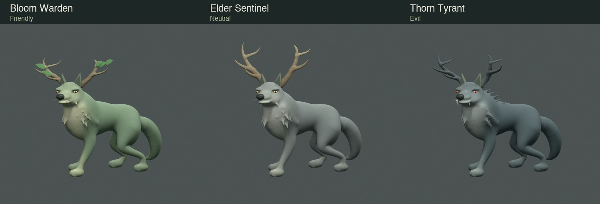

# Greatwood Wolf evolved forms

Completed via direct parent authorship on 2026-10-08 following a stopped delegation trial. Bloom Warden (Friendly), Elder Sentinel (Neutral), and Thorn Tyrant (Evil) are distinct editable Blender masters with parent-accepted gallery releases. The original Greatwood Wolf remains the baseline.

## Direct completion

A continuous neck expansion, locally fused tapered fur roots, and corrected normals replaced the detached mantles from earlier iterations.

| Native form  | Triangles | GLB bytes | Meshes | Immutable release                                                                                                                                                  |
| ------------ | --------: | --------: | -----: | ------------------------------------------------------------------------------------------------------------------------------------------------------------------ |
| `wolf-bloom` |   158,778 | 7,142,480 |     44 | [25a52679cb02](../../../packages/dcc-workbench/assets/wolf-bloom/published/releases/25a52679cb024b9f00d98f0310c641a6c82a5b1f2caa1f2ef417674286209bdf/receipt.json) |
| `wolf-elder` |   157,652 | 7,143,156 |     39 | [aab4df591adb](../../../packages/dcc-workbench/assets/wolf-elder/published/releases/aab4df591adb92f6afeb7e0ac3087f7a5510add05bb176114ec0adf283663533/receipt.json) |
| `wolf-thorn` |   160,014 | 7,232,172 |     43 | [144e0b9ab19a](../../../packages/dcc-workbench/assets/wolf-thorn/published/releases/144e0b9ab19a6922caa2676f859bb0167e744c40fac42851203f031320b587c3/receipt.json) |

- **Rig & Limits:** Each form uses a 10-joint rig, 6-second idle, and satisfies budget limits (<225,000 triangles, <12 MB, ≤16 joints).
- **Native Edit Control:** Native control `EDIT | Tail → Tail relax` defaults to 0.5 and is verified across `0 / 0.5 / 1`.
- **Gallery Integration:** Accessible via deep links `/?art=3d&study=wolf&form=<bloom|elder|thorn>`.

## Verification and closeout

- **Native tests:** All three forms pass save/reload, edit/restore, export, and browser agreement gates (`npm run test:dcc:saved -- --asset <id>`).
- **Default delivery:** Passed source-to-Three.js agreement across 5 sample times for all meshes.
- **Suite results:** Full application and DCC gates pass (**361 unit/geometry tests**, **47 DCC tests**, **52 tooling tests**, **13 Python tests**, 4 simulations).
- **Cost accounting:** Total Wolf evolution follow-up incurred **607.16 modeled Standard credit-equivalents** across 41.8 minutes; direct parent phase accounted for 236.01 credits over 23.9 minutes.

## Scope and visual failures

Prior delegated experiment stopped on 2026-10-08 after two consecutive failed clay revisions:

| Draft                           | Clay findings                                                                                           | Disposition                                          |
| ------------------------------- | ------------------------------------------------------------------------------------------------------- | ---------------------------------------------------- |
| Initial draft (all 3 forms)     | Exposed mantle caps, scarf tabs, paddle locks; repetitive spikes and chopped leaf wedges.               | First failure. Stopped for structural reconnection.  |
| Repaired representative (Thorn) | Spikes improved, but mantle formed a smooth shoulder bubble and lateral paddle instead of a grown mane. | Second failure. Experiment stopped per budget rules. |

- Preserved candidate sessions and failure receipts: `.work/sessions/wolf-evolutions-2026-10-08/`.
- Lesson: Complex anatomy requires proving fused root connections and transitions on one representative before scaling across variants.
