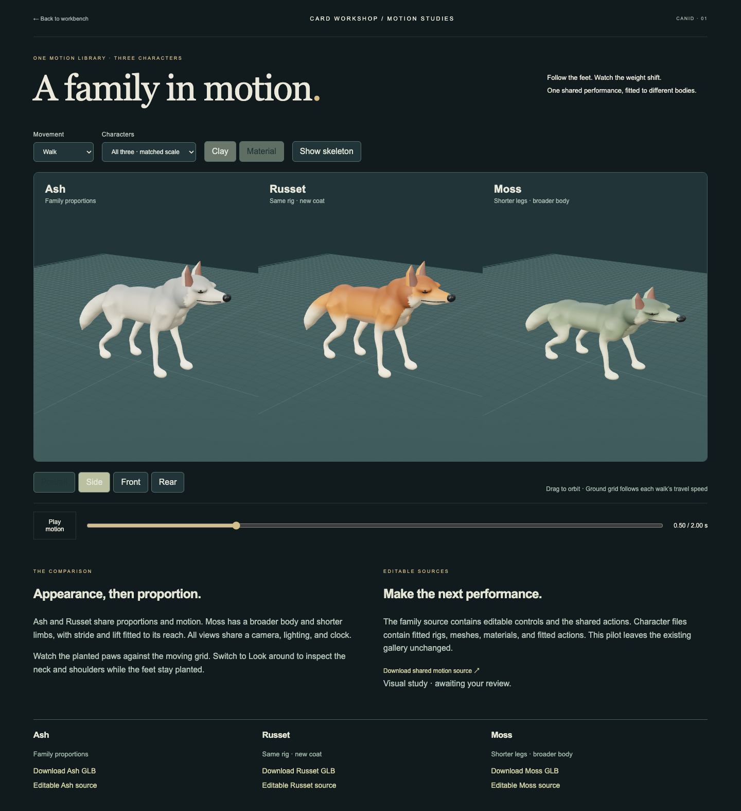
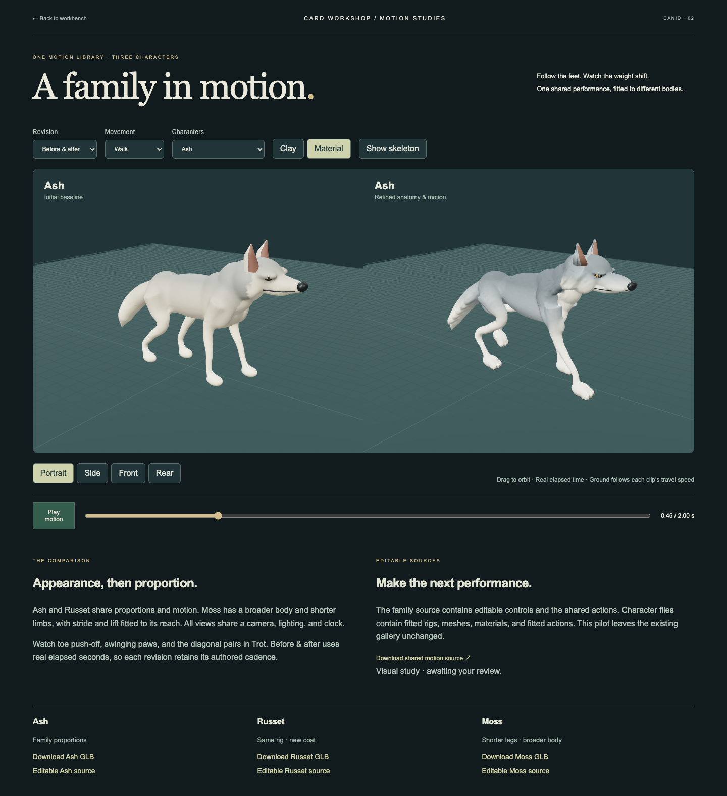

# Canid rig and motion pilot

## Accepted refinement, 2026-10-10

The user accepted the first delivery as an initial baseline and requested more developed
body detail and substantially more believable, energetic movement. The second revision
keeps stylized canid identity, with stronger anatomy, articulated paws, integrated facial
structures, directional fur groups, and restrained surface finish. The supplied dragon
diagram guides detail layering, not species or an SDF implementation.

Deliver alert idle, brisk walk, energetic trot, and a sharper planted look. Improve support,
loading/push-off, paw articulation, shoulders, pelvis, and restrained spine and secondary
motion. Author shared source motion once and fit it to all three characters. This remains
a bounded visual/rigging trial; production retopology, dense hair grooming, runtime LOD
generation, attacks, and jumps are outside this revision.

Procedural sources are first-class asset recipes in the
[family authoring home](../../../packages/dcc-workbench/subjects/canid/authoring/README.md).
Recipes generate distinct candidates; accepted saved Blender masters remain authoritative
for export. Preserve initial sources, deliveries, and receipts. Refine Ash first, then
propagate the construction to Russet and Moss, with matched baseline/refined review.

Make scoped commits for ownership, visual construction, and motion/delivery. Verify
source edit/save/reload/export, retargeting, contact and loop behavior, browser agreement,
and actual multi-view appearance. Mechanical checks do not establish visual acceptance.

## Initial baseline

The initial implementation and receipts below remain historical evidence. The user's
acceptance was specifically **initial baseline**, not a verdict that its gait or detail
was finished. The refined revision and its findings are recorded at the end of this page.

Accepted scope, 2026-10-10. Build a new animation-ready canid master, one appearance
variant with the same proportions, and one shorter-legged, heavier variant. Preserve
existing Wolf masters and gallery publications.

## What this must prove

- Author idle, walk, and planted look clips once in an editable Blender family source.
- Reuse saved motion directly on the appearance variant. Retarget the same motion to
  the proportion variant with explicit fitting and contact corrections; independently
  generating a target gait is not retargeting evidence.
- Keep connected anatomy, readable weight shifts, stable contacts, and clean shoulder
  and hip deformation. Prove the base in clay before finishing variants.
- Deliver editable character sources, baked GLBs, and an interactive workbench with
  matched cameras, shared time, clip selection, clay/material views, and ground contact.
- Demonstrate that editing a saved source clip updates all three deliveries while
  preserving character mesh data. Report source/export agreement and visual judgment
  separately. Elaborate fur, facial acting, external motion import, and gallery
  replacement are outside this pilot.

## Ownership and authoring

The DCC workbench owns the family rig, saved motion, character fitting, retargeting,
and export. Browser consumers select baked clips; they do not run a retarget solver.
The family source owns motion. Each character source owns geometry, skin weights,
materials, fitted rest skeleton, and native controls. Source creation is an explicit
bootstrap operation; export must not rebuild geometry or regenerate source animation.

A control rig is the animator's editing interface. The deformation skeleton is the
delivery interface. The retarget profile records chain correspondence, reference-pose
alignment, proportion handling, and target corrections. Start with one canid family;
introduce another family only when a second anatomy demonstrates the need.

## Verification and commits

Use coherent commits for the authoring contract and working master, motion reuse and
target fitting, then browser comparison and evidence. New Python and frontend sources
must enter existing checker scopes. Run `npm run check:full` plus affected native and
disposable-profile browser checks. Native and browser launches on this Mac use approved
execution outside the restricted sandbox.

Visual review inspects matched front, side, rear, and portrait views, motion extremes,
and small displays. Numerical checks cover contact error, finite normalized skinning,
loop continuity, shared-source propagation, and exported playback agreement. Passing
those checks does not establish aesthetic or user approval.

## Implementation and findings

The workbench pilot is available at `/?workbench=dcc&compare=canid`. Its maintained
commands and source ownership are documented in the [DCC package](../../../packages/dcc-workbench/README.md#canid-rig-and-retargeting-pilot).

| Character | Purpose                | Geometry         | Delivery                                           |
| --------- | ---------------------- | ---------------- | -------------------------------------------------- |
| Ash       | Base canid             | 27,074 triangles | 20 joints; idle, walk, look                        |
| Russet    | Appearance reuse       | 27,074 triangles | Same proportions and shared source motion          |
| Moss      | Proportion retargeting | 26,350 triangles | 1.07 length, 1.22 width, 0.77 height/stride scales |

Sources are editable native Blender files with animator controls, IK constraints,
bone-heat skinning, materials, and actions. The prototype uses a connected voxel-remeshed
skin and simplified facial anatomy; it is not hand-retopologized production topology.
The family convention fixes control axes, chain names, clip durations, and walk contact
phases. This proves fitting within one family, not arbitrary third-party skeleton
compatibility or anatomically different creatures.

### Corrections established by review

- First clay construction: overlapping tail masses read as segments, and lower-leg
  weights produced pinching. Continuous tapered forms replaced the tail and limb masses.
- Provisional distance weights produced sharp belly/shoulder transitions. Native
  bone-heat weights replaced them, with rigid supporting sole vertices and normalized
  four-influence delivery weights.
- The first export bake used stale parent transforms. Browser/native comparison caught
  errors up to 0.48 model units. Explicit parent-relative baking corrected the mismatch;
  the comparison tolerance remained 0.0001 model units.
- Contact checks now inspect supporting mesh vertices as well as ankle controls at all
  planted frames. Ground-grid travel comes from the delivered clip metadata.

### Acceptance and limits

The shared-motion mutation check changes the saved source look action and proves that
all three fitted characters receive it without changing mesh or skin-weight digests.
The browser checks every delivered character and clip at five native sample times,
including the exact loop endpoint. Sampling does not prove agreement at every possible
intermediate time. All native contact checks use the declared family stance intervals;
changing those intervals requires updating the family convention.

The parent reviewed the base clay construction and the matched browser material view.
Visual scope is a restrained stylized canid with readable weight and fitted movement;
elaborate fur and facial acting remain outside this pilot. Numerical agreement is
technical evidence, not user visual approval. Existing gallery sources and release
pointers are unchanged.

The [review receipt](../../../packages/dcc-workbench/assets/canid/review.json) links the
selected native edit proof, original and mutated consumer comparisons, and final
preview by hash. Final sampled pose error is below **0.0000014 model units**; the
largest planted-sole height or per-frame slip is below **0.0000008 model units**.
These values apply to the recorded poses and declared contact intervals, respectively.

## Refined delivery

The workbench now defaults to the refined family. **Revision** selects the initial baseline,
the refinement, or a matched before/after pair for any character. Both revisions retain
their authored cadence during comparison; the clock is elapsed seconds rather than
artificially synchronized gait phases. The floor scrolls continuously across repeated loops.

| Property              | Initial baseline             | Refined family                                             |
| --------------------- | ---------------------------- | ---------------------------------------------------------- |
| Deformation joints    | 20                           | 28, including scapulae, hocks/pasterns and ears            |
| Saved clips           | Idle 4 s, walk 2 s, look 4 s | Alert idle 4 s, walk 0.90 s, trot 0.60 s, look 2.50 s      |
| Sampling              | 24 fps                       | 60 fps                                                     |
| Ash / Russet geometry | 27,074 triangles             | 78,190 triangles                                           |
| Moss geometry         | 26,350 triangles             | 77,752 triangles                                           |
| Refined delivery size | —                            | 3.35–3.37 MB per GLB, including packed fine normal texture |

The body has a more differentiated chest, tucked waist, shoulder and thigh transitions,
articulated hocks, toe shapes and clefts, claws, fitted lids, nostrils and ear bowls.
Broad fur locks merge into the continuous ruff, cheek and brush silhouette. Fine relief,
regional pigment and a packed normal texture finish the surface without covering the
quiet flanks in repeated ornament. The first detached fur-lock pass was rejected because
it read as tiled scales. These are detail stages; no runtime LOD system is claimed.

### Motion corrections and references

The original controls pointed along world Z, making Blender's local Z channel point along
world −Y. A native read of the preserved baseline confirmed that its front paw varied in
height by only **0.0000011 model units** across the walk. The old contact checks examined
declared stance intervals and did not require swing clearance, so they missed this defect.
The refined foot/body controls have explicit world XYZ axes. Delivery checks now require
vertical clearance for every moving foot and examine all low foot/claw vertices for
penetration, alongside planted toe height/slip, limb reach and loop closure.

The walk uses a lateral footfall sequence; the trot pairs opposite fore/hind limbs.
Foot trajectories match ground velocity at lift-off and touchdown. Paw roll pivots about
the supporting toe; target fitting removes the source pivot offset, scales travel/lift,
and reapplies the saved rotation around the target's proportioned toe. Shoulders, pelvic
rotation, restrained spine response, head stabilization and delayed tail/ear motion
accompany the limbs. A foreleg reach failure and late-swing heel penetration were corrected
before final export, without relaxing the contact thresholds.

These are authored stylized movements informed by measured canine locomotion, not mocap
or biomechanical validation. [Gait transitions](https://journals.biologists.com/jeb/article/216/12/2257/11423/Gait-transitions-and-modular-organization-of)
informed the distinction between stance, swing and gait ordering. The
[pelvis/lumbar study](https://pubmed.ncbi.nlm.nih.gov/26831181/) supports pelvic motion coupled
to the limbs with relatively restrained spinal excursions. The
[hind-limb kinematics study](https://pmc.ncbi.nlm.nih.gov/articles/PMC6242825/) informs the
need for articulated hocks and proportion-aware fitting. Exact recipe values are artistic
choices; model units have not been calibrated to metres.

### Verification and review

All three native deliveries pass toe contact, ground penetration, reach and loop checks.
The largest planted toe height/slip error is below **0.0000012 model units**. Across the
three characters, the least-raised foot reaches at least **0.122 model units** in walk and
**0.184 model units** in trot. Those are sampled peak clearances, not instantaneous minimum
heights throughout swing. Ground penetration at the inspected low vertices is below
**0.0000007 model units**, within floating-point noise.

The saved-source mutation proof changes the look action at frame 45 by 0.18 radians,
saves/reloads, fits and exports every character with unchanged mesh/weight digests. It also
checks that recipe construction refuses existing masters. Browser/native sampled agreement
is below **0.0000019 model units** for both original and edited deliveries. The three affected
browser cases pass. See the [review receipt](../../../packages/dcc-workbench/assets/canid/refined/review.json)
for exact coverage and repository-gate status. The local `npm run check:full` gate passed:
maintenance/build, 253 application tests, four simulations and 127 geometry tests. One
unrelated usage-tool loopback case was skipped by the restricted sandbox; remote CI was
not run.

Parent review covered native clay/material, a trot extreme, browser side/portrait and
front/rear views, before/after comparison and phone layout. This remains a stylized visual
and rigging trial with remeshed topology. Dense fur grooming, production retopology,
runtime LODs and arbitrary external-rig compatibility remain outside scope. User visual
approval is pending; technical checks are not a substitute.

## Action trial · accepted scope · 2026-10-10

Extend the refined family with gallop, a turning and accelerating flee performance,
three distinct one-shot attacks (lunge, articulated bite and forepaw swipe), and a
playful shoulder-over-back roll that returns to its feet. Review Ash, Russet and
shorter, broader Moss in clay and material, including inverted poses and contact changes.
The initial baseline remains intact; Git revision `e5630aa` preserves the preceding
four-clip refined sources and delivery.

The saved motion master owns each clip's duration, loop/one-shot behavior, scene
trajectory, named support phases and visual timing markers. Recipes initialize these
fields; fitting and export consume the saved values without regenerating the performance.
Scene travel has one owner in playback, separate from the local skeleton. Retargeting
must preserve world-space stance during turns and refit rolling contact to each body.
Full-body floor checks complement paw contacts; one-shot actions do not require loop closure.

Last Hearth keeps its card board and adds a focused 3D attack stage for Briar Stray.
Lunge, bite and swipe are deterministic presentation variants of already-resolved attacks.
The replay clock drives both views, including pause, seek, speed and reduced motion.
Damage and outcome remain authoritative in the existing combat rules. Flee and playful
roll remain workbench performances because the game has no corresponding rules.

Completion requires saved-source edit/save/reload/export propagation, native/browser pose
agreement, one-shot completion and replay, visible scene travel, contact evidence across
all three bodies, and the full repository gate plus affected browser checks. Technical
verification remains separate from visual review. This section records the accepted scope;
implementation evidence follows only after execution.
